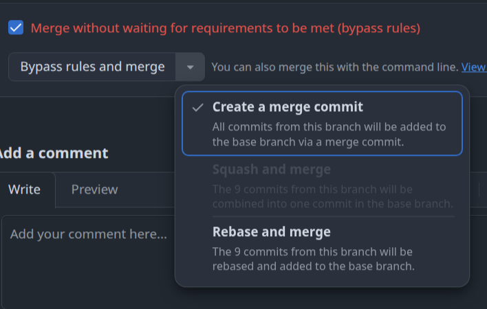

# No-Squash Guard

Chrome extension. Disables **Squash and merge** on a GitHub PR when the PR's **source (head)** branch is protected — the FROM side, not the base. Stops accidental squash-merges of long-lived branches (e.g. `qa` → `main`).

## Install
1. `chrome://extensions` → enable Developer mode.
2. Load unpacked → select this folder.

## Config
Click the toolbar icon. Edit the protected source-branch list (default `qa`, `main`, `master`), one per line, Save.

## How it works
- `content.js` reads the head branch from the PR header (last `[data-component="BranchName"]`), matched case-insensitively, owner prefix stripped for cross-fork PRs.
- If it's protected, any "Squash and merge" control — the confirm button and the method-dropdown option — is disabled, plus a capture-phase click guard as backstop against re-renders.
- Runs on `github.com/*/*/pull/*` only.
